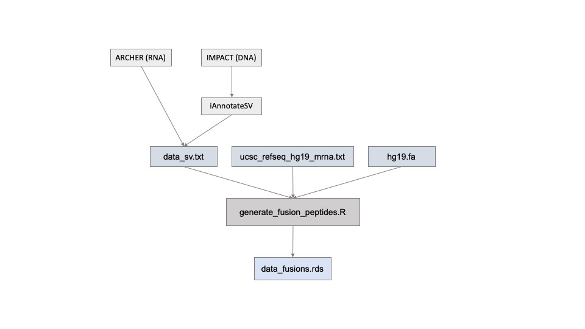

# Gene Fusion Peptide Sequence Extraction



This script processes gene fusion data from IMPACT and ARCHER. The workflow involves filtering and parsing fusion data, extracting exon information, retrieving DNA sequences from a reference genome, and generating peptide sequences around fusion breakpoints.

Author: Helen Xie

## Table of Contents

- [Gene Fusion Peptide Sequence Extraction](#gene-fusion-peptide-sequence-extraction)
  - [Table of Contents](#table-of-contents)
  - [Installation](#installation)
  - [Usage](#usage)
    - [Command Line Arguments](#command-line-arguments)
  - [Input Files](#input-files)
  - [Output](#output)
  - [Steps Performed](#steps-performed)

## Installation

To run this script, you need to have R installed on your system. Additionally, the following R packages are required:

- `data.table`
- `dplyr`
- `stringr`
- `tidyr`
- `Biostrings`

You can install these packages using the following command:

```R
install.packages(c("data.table", "dplyr", "stringr", "tidyr"))
if (!requireNamespace("BiocManager", quietly = TRUE))
    install.packages("BiocManager")
BiocManager::install("Biostrings")
```

## Usage

Run the script from the command line as follows:

```bash
Rscript your_script.R data_sv.txt ucsc_refseq_hg19_mrna.txt hg19.fa
```

### Command Line Arguments

- **data_sv.txt**: The gene fusion data file from MSK-IMPACT.
- **ucsc_refseq_hg19_mrna.txt**: The exon bed file for the hg19 genome.
- **hg19.fa**: The reference genome FASTA file for hg19.

## Input Files

1. **data_sv.txt**: A file containing gene fusion data, including details on chromosomes, positions, and annotations.
2. **ucsc_refseq_hg19_mrna.txt**: A BED file containing exon information for the hg19 genome.
3. **hg19.fa**: A FASTA file with the hg19 reference genome sequence.

## Output

- **data_fusions.rds**: An RDS file containing processed gene fusion data with the following columns:
  - `Sample_ID`
  - `Site1_Chromosome`
  - `Site2_Chromosome`
  - `Site1_Position`
  - `Site2_Position`
  - `Site1_Description`
  - `Site2_Description`
  - `Class`
  - `Event_Info`
  - `Connection_Type`
  - `Annotation`
  - `First_Transcript_ID`
  - `Second_Transcript_ID`
  - `First_Gene`
  - `Second_Gene`
  - `First_Exons`
  - `Second_Exons`
  - `First_Sequence`
  - `Second_Sequence`
  - `Fusion_Sequence`
  - `Peptide_Sequence`
  - `Peptide_Breakpoint`
  - `NetMHC_Peptide`

## Steps Performed

1. **Read and Parse Fusion Data**: Filters and processes fusion data to extract relevant information like transcript IDs, gene names, and exon ranges.
2. **Read and Parse BED File**: Processes the exon BED file to extract transcript IDs and exon numbers.
3. **Retrieve DNA Sequences**: Uses `bedtools getfasta` to extract DNA sequences corresponding to exon ranges from the reference genome.
4. **Generate Peptide Sequences**: Translates the DNA sequences into peptide sequences and identifies breakpoints in the fusion peptides.
5. **Save Output**: The processed data, including the fusion peptides and their surrounding sequences, are saved to an RDS file for downstream analysis.
